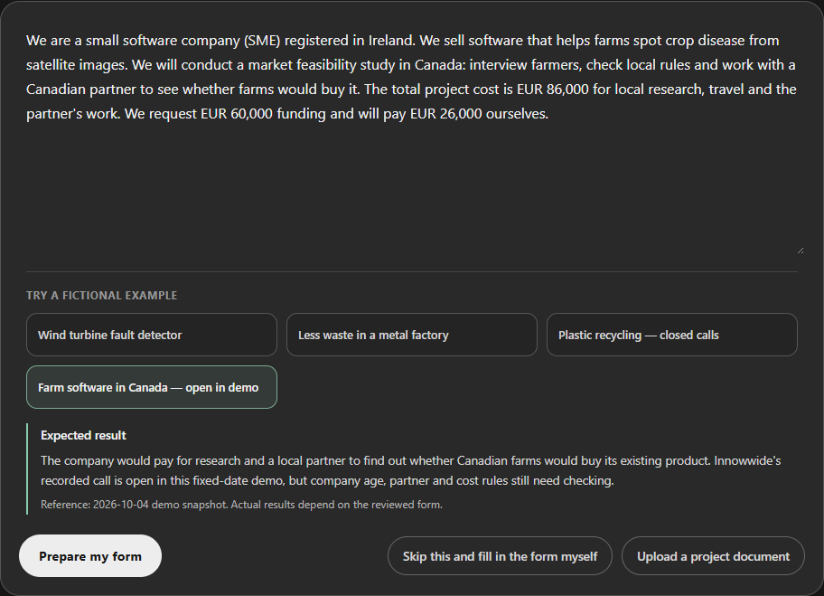
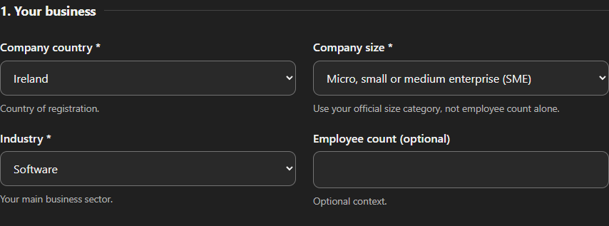
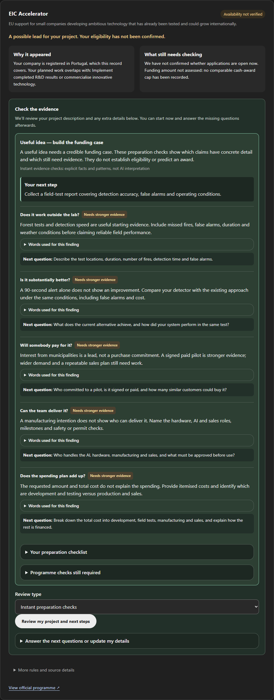

# Gratify

**Find funding programmes worth a closer look.**

Gratify helps startups and small businesses turn a project idea into a short, explainable list of European funding opportunities.

## How it works

### 1. Describe your project

Write a short description, upload a document, or fill in the form yourself. AI can suggest answers, but you stay in control.

### 2. Check the details

Review your company, planned activities, and funding request. Every suggested answer is editable before the search.

### 3. Explore the shortlist

Try the fictional forest-fire detector. Its cameras detect smoke, but is the project ready to seek funding? Instant checks examine field tests, technical advantage, customer demand, team and spending. An optional AI review interprets the evidence more deeply. Findings quote your own words, ask specific follow-up questions and build a preparation checklist.

## What the results mean

Gratify shows possible leads. Your follow-up answers can reveal a likely blocker or an unanswered requirement, but **they do not confirm eligibility**. Check the full rules at the official source before applying.

Gratify is a pilot with 10 manually reviewed programme records. The presentation demo uses a fixed date of **4 October 2026**; the regular view uses today's date but does not fetch live funding updates.

[Explore the examples and testing guide](docs/PILOT_TESTS.md)

[What I learned building the AI system](docs/AI_LESSONS.md)
